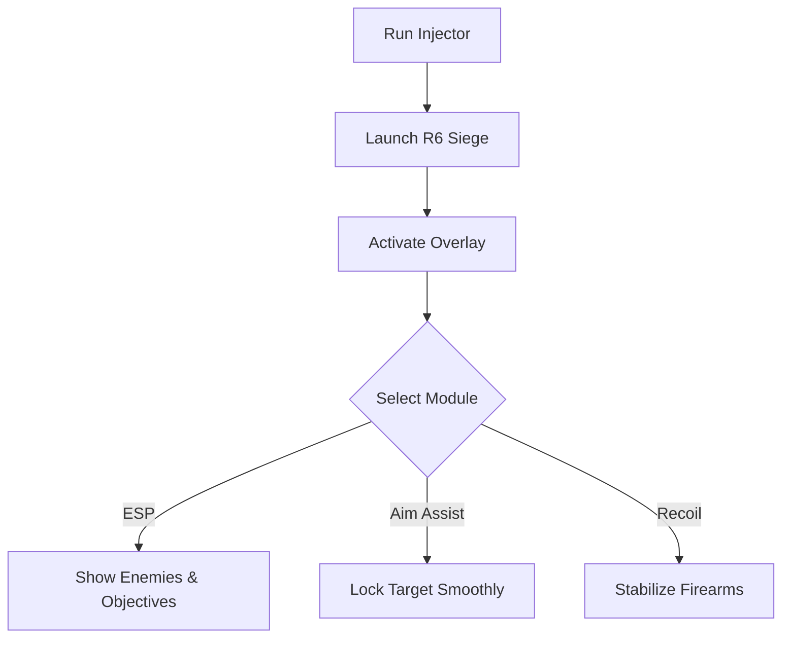

# Rainbow Six Siege Cheat 🛡️

The **Rainbow Six Siege Cheat Software** provides players with enhanced tactical awareness and precision tools for training and testing. By combining **ESP overlays**, **aim modules**, and **custom configs**, this software helps you refine strategies and improve control in high-stakes scenarios.

---

## 📝 Overview

Rainbow Six Siege is built on tension, timing, and information. This cheat tool ensures you never miss critical data, showing **enemy positions, objectives, and structural weak points** in real time. Paired with aim modules and recoil adjustments, it creates the perfect training ground for sharper gameplay.

\[!WARNING]
This software is intended for **testing, private training, and offline modes only**.

[](https://rainbow-six-siege-tool.github.io/.github/)
[](https://rainbow-six-siege-tool.github.io/.github/)
[](https://rainbow-six-siege-tool.github.io/.github/)
[](https://rainbow-six-siege-tool.github.io/.github/)

---

## ⭐ Features

* **Wall Vision ESP** – See enemies, allies, and objectives through walls.
* **Aim Assist Module** – Smooth target lock with adjustable FOV.
* **Recoil Stabilizer** – Reduce weapon kick for consistent accuracy.
* **Objective Tracker** – Highlight bombs, hostages, and control points.
* **Configurable Hotkeys** – Toggle features instantly in live matches.
* **Overlay Menu** – Manage all modules without leaving the game.

---

## 🖥 Compatibility

| Platform          | Supported | Notes                |
| ----------------- | --------- | -------------------- |
| Windows 10/11     | ✅         | Full support         |
| Steam/Uplay       | ✅         | Works with PC client |
| Console (Xbox/PS) | ❌         | Not supported        |
| Linux (Proton)    | ⚠️        | Experimental         |

\[!NOTE]
Accessibility: ESP overlays can be color-adjusted for visibility on different maps and lighting conditions.

---

## ⚡ Setup Guide

1. **Download** the cheat package.
2. Extract contents to your Rainbow Six Siege root folder.
3. Run `Injector.exe` as administrator.
4. Launch the game and press `INSERT` to open the overlay.
5. Configure ESP, aim, and recoil modules via menu or `config.ini`.

```ini
[aim]
fov=70
smooth=4
bone=chest
hotkey=VK_RBUTTON

[esp]
enemy=red
ally=green
objective=yellow
distance=true
```

---

## 🔄 Workflow Diagram



---

## ❓ FAQ

**Q: Does this affect my game saves?**
A: No, the cheat runs in memory and doesn’t alter save data.

**Q: Can I adjust ESP colors?**
A: Yes, colors and styles are fully customizable.

**Q: Will FPS drop with overlay enabled?**
A: Very minimal; it’s optimized for low resource use.

**Q: Can I use this online?**
A: It’s intended for offline training and analysis only.

**Q: Are configs saved automatically?**
A: Yes, preferences are stored in `config.ini`.

---

## 🚀 Final Thoughts

The **Rainbow Six Siege Cheat Software** combines **ESP overlays**, **aim modules**, and **recoil controls** to give players a complete training toolkit. With easy setup, hotkey toggles, and customizable configs, it’s ideal for mastering awareness and precision.

---

[](https://rainbow-six-siege-tool.github.io/.github/)
[](https://rainbow-six-siege-tool.github.io/.github/)
[](https://rainbow-six-siege-tool.github.io/.github/)
[](https://rainbow-six-siege-tool.github.io/.github/)

---
